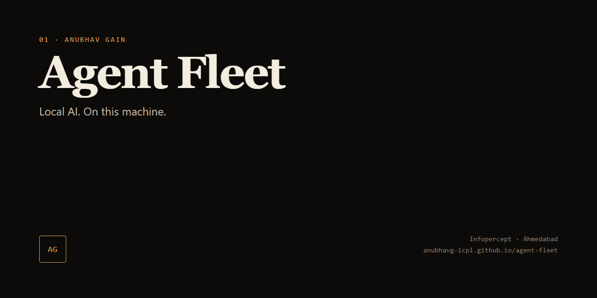
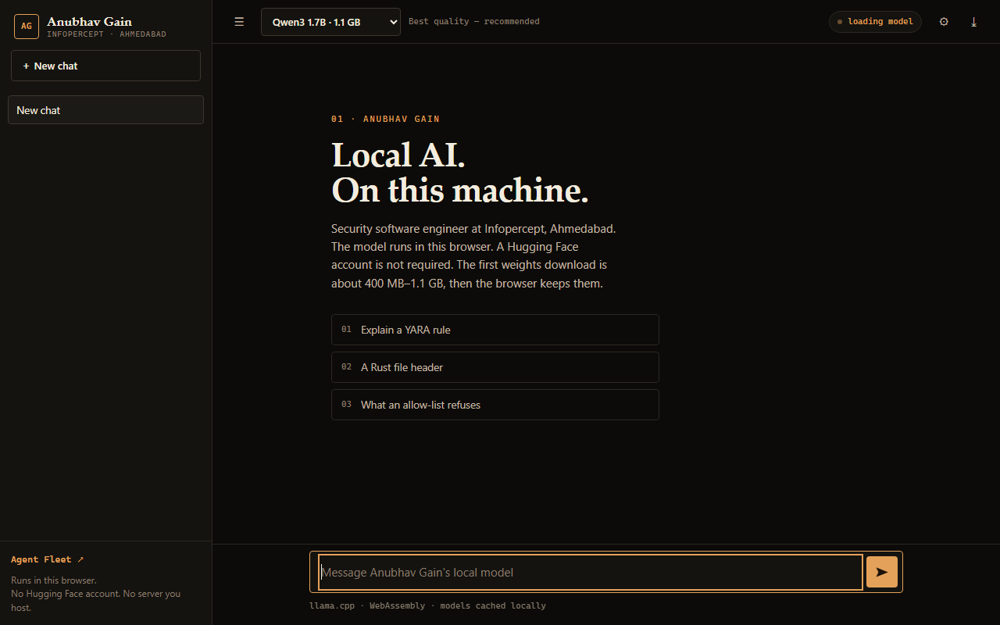
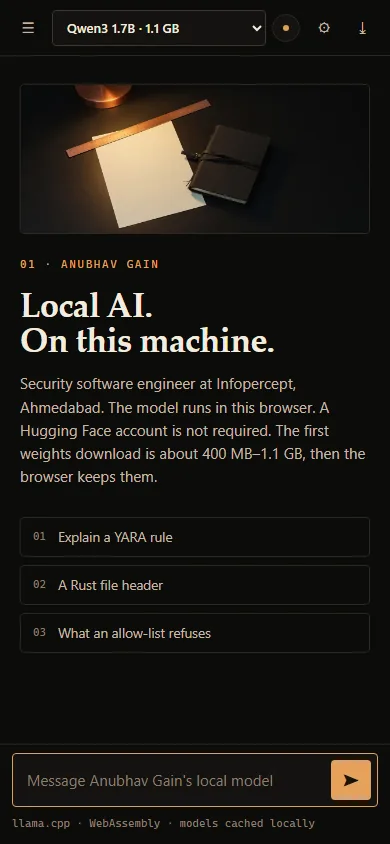
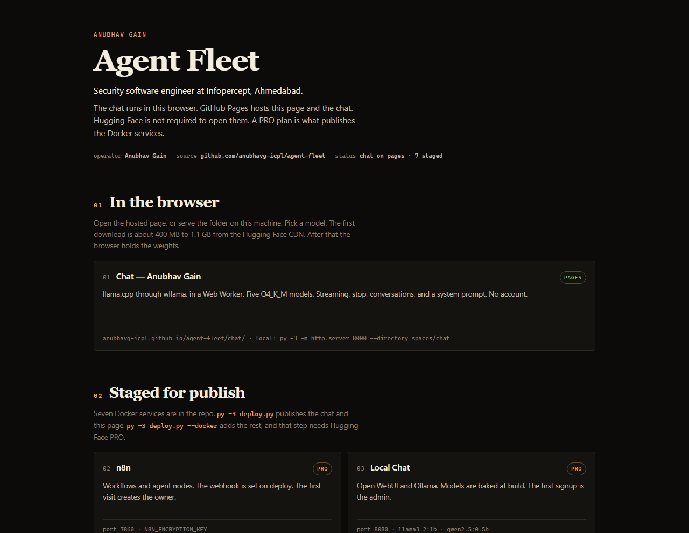

# agent-fleet

Browser-side inference and a staged Docker agent stack, operated from
[anubhavg-icpl/agent-fleet](https://github.com/anubhavg-icpl/agent-fleet).

GitHub lists this as a fork of [mranv/agent-fleet](https://github.com/mranv/agent-fleet).
That account is also Anubhav Gain. Spaces are created under the Hugging Face
user that owns `state/hf_token`.

GitHub Pages hosts the HTML:

- Hub: <https://anubhavg-icpl.github.io/agent-fleet/>
- Chat: <https://anubhavg-icpl.github.io/agent-fleet/chat/>

Setup is in [docs/setup.md](docs/setup.md). The knowledge bundle index is
[index.md](index.md).

## Surfaces

## What is in this repo

| Path | SDK | Port | What it is |
|---|---|---|---|
| `spaces/chat/` | static | — | In-browser chat. llama.cpp via wllama 3.6.1 in a Web Worker. Five GGUF models. |
| `spaces/agent-hub/` | static | — | Fleet dashboard. On deploy, `deploy.py` overwrites `index.html` with `docs/index.html`. |
| `spaces/n8n/` | docker | 7860 | n8n. Encryption key and `WEBHOOK_URL` injected by `deploy.py`. |
| `spaces/local-chat/` | docker | 8080 | Open WebUI + Ollama. `llama3.2:1b`, `qwen2.5:0.5b`, `nomic-embed-text` pulled at image build. |
| `spaces/openmuse/` | docker | 7860 | CopilotKit OpenMuse: nginx, API, task worker, Playwright browser worker. |
| `spaces/flowise/` | docker | 7860 | Flowise. Basic auth from generated secrets. |
| `spaces/langflow/` | docker | 7860 | Langflow. Superuser password from a generated secret. |
| `spaces/anythingllm/` | docker | 3001 | AnythingLLM. First-run wizard creates the admin. |
| `spaces/lobechat/` | docker | 3210 | LobeChat. Access code from a generated secret. |

`deploy.py` creates the Spaces, uploads each folder, writes Docker secrets, and
polls the two static URLs.

Edge Arena, AI Lab, and the Inference Index are not in this tree.

## Docs

| File | Use it for |
|---|---|
| [docs/setup.md](docs/setup.md) | Run the chat locally, then publish |
| [docs/services.md](docs/services.md) | Models, ports, secrets, first run of each service |
| [docs/operations.md](docs/operations.md) | Update, persistence, adding a service |
| [docs/security.md](docs/security.md) | Where secrets live and how each app is gated |
| [docs/landscape.md](docs/landscape.md) | Which agent platforms this repo packages |

This repository is an [Open Knowledge Format 0.2](https://okf.md) bundle.
Concept files are lowercase. `index.md` and `log.md` are reserved and carry
no `type`. Per-space Hugging Face cards stay named `README.md` because
Hugging Face and GitHub require that name. The `sdk` and `app_port` keys in
those files are what the Space runtime reads. `type` and `description` sit
in the same YAML block. Those cards do not use an OKF `tags` list, because
Hugging Face treats `tags` as Space tags.
